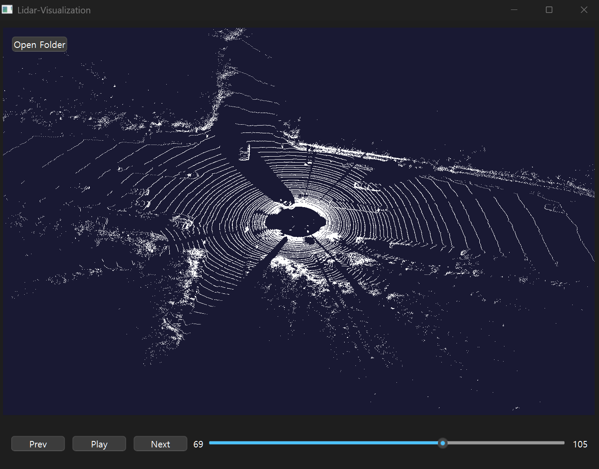

# Lidar-Visualization

## Introduction
Lidar-Visualization is a CMake-based Qt project that serves as a desktop application focused on the real-time visualization of large point cloud data using OpenGL. The project is designed to load a `.bin` file from the KITTI dataset, enabling users to explore and playback the data through an intuitive user interface.



<br/>

## Table of Contents
- [Lidar-Visualization](#lidar-visualization)
  - [Introduction](#introduction)
  - [Table of Contents](#table-of-contents)
  - [Features](#features)
  - [Dependencies](#dependencies)
  - [Installation](#installation)
  - [Usage](#usage)

<br/>

## Features
- **KITTI Data Loading Module**: Parsing and Loading Point Cloud Data in .bin Format
- **Real-Time Loading Feedback**: Display loading status using QProgressDialog when loading a `.bin` file.
- **Point Cloud Player**: Provides a Dedicated User Interface for Playback of KITTI-Based Data
- **OpenGL Rendering**: High-Performance Visualization of Large Data Sets

<br/>

## Dependencies
- Qt6 (tested with Qt 6.8.3)
- CMake ≥ 3.19
- C++ 17 ≥ or later

⚠️ **Note**: This project is developed and tested **exclusively on Windows**.

<br/>

## Installation
```bash
# Clone the repository
git clone https://github.com/ArtistDeveloper/Lidar-Visualization.git
cd Lidar-Visualization

# Run cmake (Set your own Qt path)
cmake -B build -DCMAKE_PREFIX_PATH="C:/Path/To/Your/QtVersion"

# Build the project
cmake --build build
```

<br/>

## Usage
1. Launch the application from the generated build directory.
2. Use the file menu or UI to load a .bin point cloud file.
3. Visualize and explore the data using the playback and camera control features.


To Do
- [ ] Add support for camera viewpoint manipulation (rotation, zoom, pan)
- [ ] Add 2D grid overlay
